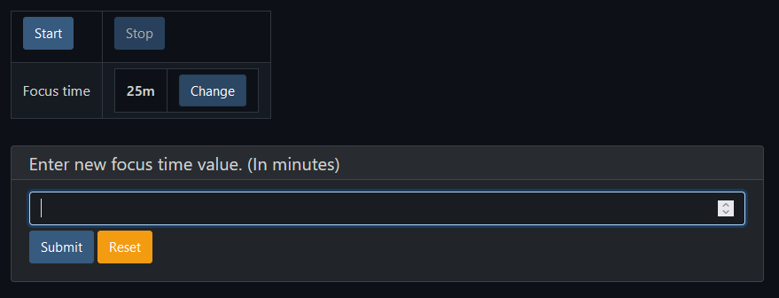

# EyeComfort
**EyeComfort** - is a utility to help your eyes. This project gives you the ability to set reminders for breaks while 
working and much more. After launching the project, a website will be activated where you can configure 
everything. The site can also be posted on free hosting (PythonAnyWhere and others) and 
everything can be configured from a phone or other devices that have access to the Internet. 


## Table of Contents
- [Installation](#installation)
- [Usage](#usage)
- [Features](#features)
- [Contributing](#contributing)
- [License](#license)
- [Disclaimer](#disclaimer)
- [Contacts](#contacts)


## Installation
Requirements: `Tested on Python == 3.11.6 and 3.10.6`

Note: For Linux use `python3`, `pip3` and `.sh`

Clone repository
```bash
git clone https://github.com/Welryzis/EyeComfort
```

Change folder
```bash
cd EyeComfort
```

Fill `config.py` file
```python
TG_BOT_TOKEN = "TelegramBotToken"
TG_CHAT_ID = "Your Telegram chat id"
TG_MESSAGE = "Time ;)"

FLASK_SECRET_KEY = "JustRandomSuperSecretKeyForWebUI228"
```

Start `main.py` file

***In order for the bot to send you messages, you need to enter /start in the chat with the Telegram bot before starting the project.***
```bash
python main.py
```


## Usage



## Features
- Easy-to-use


## Contributing
Before you begin contributing to our project, it is important to familiarize yourself with and agree to the following documents:

1. **License**: By contributing, you agree to your code being licensed under the project's license. Please review the [LICENSE](LICENSE) for details.

2. **Disclaimer**: Please read and understand our project's disclaimer, which can be found in [DISCLAIMER.md](DISCLAIMER.md). 

We appreciate your willingness to contribute to our project. Follow these guidelines to ensure a smooth and collaborative contribution process:


### Reporting Issues
If you encounter a bug, have a suggestion, or want to request a new feature, please check if there's already an existing issue related to it in our issue tracker. If not, feel free to create a new issue, providing as much detail as possible, including:

- A clear and descriptive title.
- Steps to reproduce the issue.
- Expected and actual behavior.
- Your environment (OS, browser, version, etc.).


### Making Changes
If you want to work on an existing issue or implement a new feature, follow these steps:

1. Fork the repository to your GitHub/GitLab account.
2. Create a new branch for your changes: `git checkout -b feature/your-feature-name`.
3. Make your changes, ensuring that your code follows our coding standards and conventions.
4. Test your changes thoroughly.
5. Commit your changes with a clear and concise commit message.
6. Push your changes to your fork on GitHub: `git push origin feature/your-feature-name`.
7. Create a Pull Request (PR) in our repository, describing the changes you've made and referencing any related issues.
8. We'll review your PR, provide feedback, and work with you to address any concerns or suggestions.

We appreciate your contributions, and thank you for helping us improve our project. Your efforts make a difference, and we're grateful for your support.


## License
This project uses the license [Apache License, Version 2.0](LICENSE). Please read the license file carefully before using the project.


## Disclaimer
This project uses a disclaimer. Please, before starting to use this project, carefully read the file: [DISCLAIMER.md](DISCLAIMER.md). By using this project you agree with all points in this file.


## Contacts
Email: welryzis.public@gmail.com


##
Copyright (c) 2023 Welryzis

Licensed under the Apache License, Version 2.0 (the "License");
